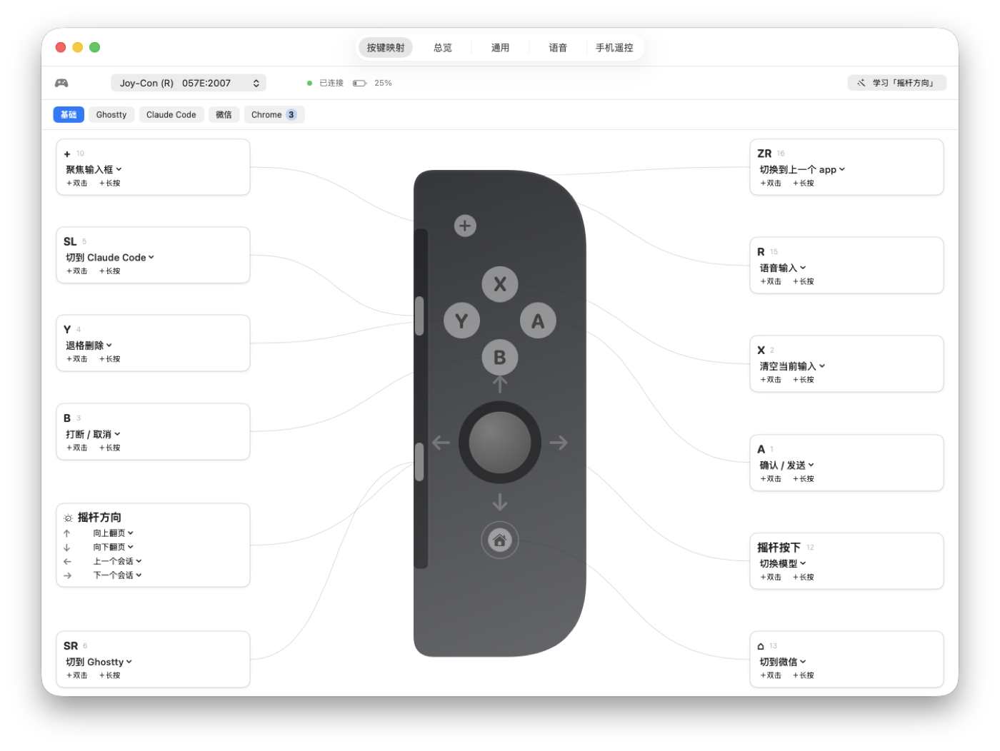
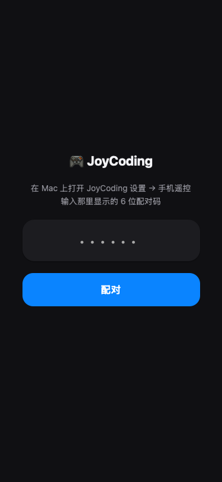
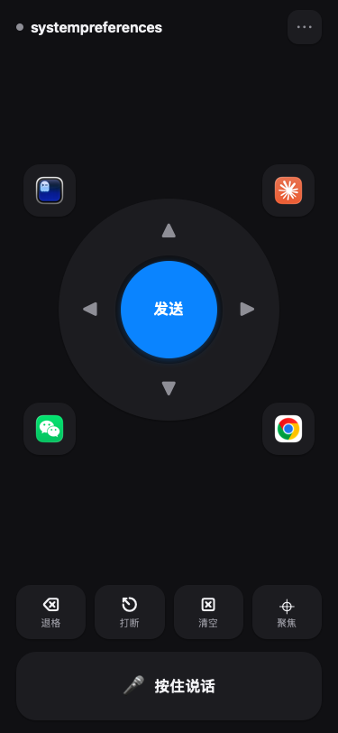
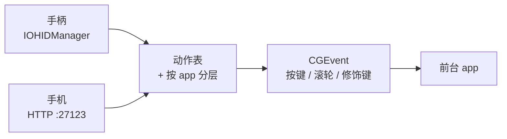

<div align="center">


# JoyCoding

**把游戏手柄——或者你的手机——变成 macOS 的编程遥控器。**

中文 · [English](README.md)

</div>

---

用说的代替打字。一只手拿 Joy-Con 就能确认、打断、翻页、切会话，另一只手还在鼠标上。
不想拿手柄的时候，手机也能干同样的事。

<div align="center">

</div>

## 为什么做这个

和 AI agent 协作，大部分时间是在一个循环里：**读 → 说一句 → 批准 → 打断**。
这几件事都不需要键盘。JoyCoding 把这个循环搬到了手柄上：

- **按住扳机说话** —— 对接任何听写工具的按住式热键
- **一个键发送**，一个键打断，一个键翻页
- **同一颗键在不同 app 里做对的事** —— `Y` 在编辑器里是退格，在 Chrome 里是后退，
  因为浏览器里根本没有文字可删

## 特性

- 支持**任何 HID 手柄** —— Joy-Con（左/右）、Switch Pro、PlayStation 等
- **按 app 分层**：一套基础映射 + 各 app 的覆盖
- 每颗键都有**单击 / 双击 / 长按**三层
- **按住说话**可以合成裸修饰键（比如按住左 Control）
- **手机遥控**走局域网，6 位配对码只输一次
- 任天堂手柄的**电量显示**（macOS 完全不暴露这个，做法见 [文档](docs/battery.md)）
- 配置时按键**实时点亮**，不用猜编号
- 内置默认配置，插上手柄就能用

## 支持的手柄

| 手柄 | 按键数 | 说明 |
|---|---|---|
| Joy-Con（左）/（右） | 11 | 摇杆方向要学一次——横持竖持会整体转 90° |
| Switch Pro | 13 | Home 键被 macOS 拿去开游戏覆盖层了 |
| PlayStation | 14–15 | 外观图和默认配置已备好，按键编号未实测 |
| 其它 HID 手柄 | — | 映射功能正常，只是没有外观图 |

## 安装

**下载**：从 [Releases](../../releases) 拿公证过的安装包，解压拖进「应用程序」，双击打开。

**或者自己编译**（需要 Xcode 命令行工具）：

```bash
git clone https://github.com/YOURNAME/joycoding.git
cd joycoding && ./build.sh --no-notarize
```

## 快速上手

1. 打开 JoyCoding，按提示在系统设置里授予**辅助功能**，然后点 app 里的
   **「重启 JoyCoding」** —— macOS 对已运行的进程不会即时生效。
2. 蓝牙连上手柄，默认配置自动套用。
3. Joy-Con 需要跑一次**「学习摇杆方向」**，按你平时的握法推四个方向。

## 手机遥控

<div align="center">

&nbsp;&nbsp;&nbsp;

</div>

打开**设置 → 手机遥控**，扫二维码，或者手输一次 6 位码。地址就是
`http://<你的Mac>:27123/`，真正的凭据配对后存在 Cookie 里。
Safari 里「添加到主屏幕」就能全屏运行。

四个角是 app 直达键，用的是真实 app 图标；功能行跟着前台 app 变。

> ⚠️ 这个接口能合成键盘事件。只在可信的内网或 Tailscale 里用，**绝不要做端口转发**。

## 工作原理



一张动作表同时服务两个入口，所以加一个动作，手柄和手机同时就有了。
一个动作具体发什么键，是**按下那一刻**根据前台 app 决定的。

## 已知限制

- **Home / PS 键被 macOS 截走**去开游戏覆盖层。除非独占设备（那样游戏就用不了手柄了），
  应用层没有办法。
- **Joy-Con 摇杆方向必须现场学** —— HID 帽子开关是按横持定义的，竖着拿所有方向转 90°。
- **上不了 Mac App Store** —— 需要辅助功能和原始 HID 访问，沙盒两样都不给。
- Web 界面的元素不暴露给无障碍接口，所以「聚焦输入框」是按位置点击，不是真正的聚焦调用。

## 致谢

这个项目站在别人的工作之上：

- **[JoyType](https://github.com/0xDarcyJ/JoyType)** —— 它的注释点出了让电量读取跑通的两件事：
  输出报告必须补齐到 49 字节，以及 report id 要留在缓冲区第 0 字节
  （尽管 `IOHIDDeviceSetReport` 已经单独接收它）。没有它我已经把这个功能判定为做不到了。
- **Linux 内核 `hid-nintendo.c`** —— `0x30` 完整输入报告的按键位序。
- magicien 的 **[JoyKeyMapper](https://github.com/magicien/JoyKeyMapper)** 和
  **[JoyConSwift](https://github.com/magicien/JoyConSwift)** —— 这个想法的起点。
- **[Hammerspoon](https://www.hammerspoon.org)** —— 整套东西最初是在它上面用 Lua 跑通的原型。
- **Apple TV Remote** 和 **Google TV Remote** —— 手机界面的设计参考。

## 许可

MIT，见 [LICENSE](LICENSE)。

Nintendo、Switch、Joy-Con、PlayStation 均为各自所有者的商标。
本项目与它们没有任何关联，也未获得其认可。
